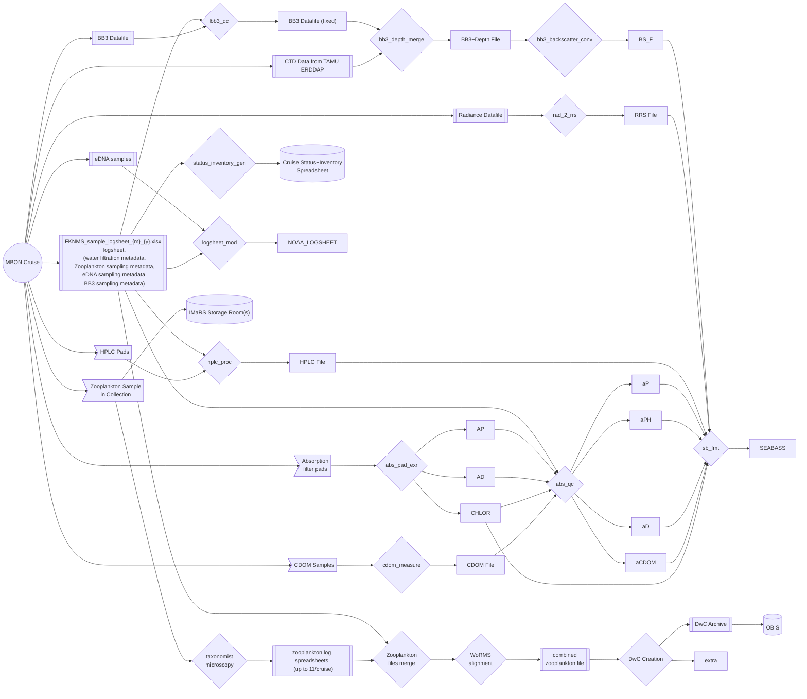

## Data Pipeline Overview

### Pipeline processes:
process              | description
---------------------|-------------------------------------------
status_inventory_gen | usf-imars/mbon_cruise_scripts::merge_meta_chl_hplc_cdom.Rmd QC on logsheets & create collection Event Rows (station_id + stations) in the status inventory sheet.
bb3_qc               | Sebastian has a WiP QC python script
bb3_depth_merge      | Merge BB3 & Depth data - TODO: how?
bb3_backscatter_conv | convert BB3+Depth data into backscatter - TODO: how?
rad_2_rrs            | Radiance to RRS conversion - TODO: how?
hplc_proc            | HPLC Processing done by Crystal @ NASA
taxon_id             | Taxonomist IDs Plankton from sample aliquot(s)
dwc_align            | DwC Alignment
abs_pad_extr         | extraction from filter pads
abs_qc               | Aborbance post-processing done by Jenn
cdom_measure         | CDOM Measurement taken
sb_fmt               | format and upload data to SEABASS
logsheet_mod         | modify logsheets & send to NOAA (Luke Thompson + Enrique)
  

