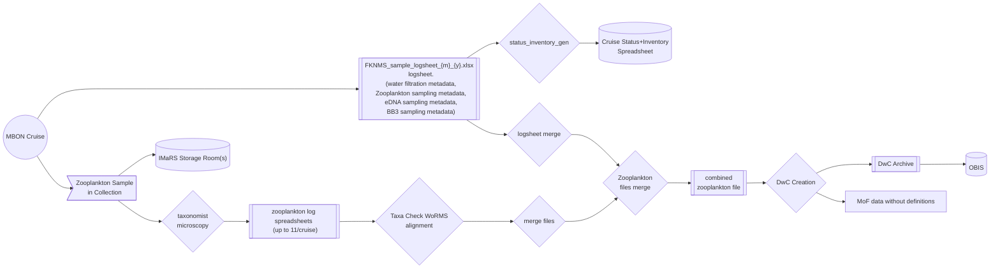

```mermaid
graph LR

CRUISE((MBON Cruise))

%% === cruise outputs:
%% === cruise outputs:
%% physical samples
CRUISE --> ZOO>Zooplankton Sample \n in Collection]
%% data files
CRUISE --> LOGSHEET[["
  FKNMS_sample_logsheet_{m}_{y}.xlsx
  logsheet.
  (water filtration metadata,
  Zooplankton sampling metadata,
  eDNA sampling metadata,
  BB3 sampling metadata)
"]]

%% === inventory pipeline
LOGSHEET --> ROWS_GEN{status_inventory_gen}
  --> INVENTORY[(Cruise Status+Inventory \n Spreadsheet)]


%% === zooplankton pipeline
TAXIZE{taxonomist \n microscopy}
WORMS_ALIGN{Taxa Check WoRMS \n alignment}
FILES_MERGE{"merge files"}
LOG_MERGE{"logsheet merge"}
ZOO_MERGE{Zooplankton \n files merge}
ZOO_COMBINED[[combined \n zooplankton file]]
DWC_CREATE{DwC Creation}
ZOO_LOG[["zooplankton log spreadsheets \n (up to 11/cruise)"]]
DWC[[DwC Archive]]
OBIS[(OBIS)]
nonMoF[MoF data without definitions]
STORE[("IMaRS Storage Room(s)")]

ZOO --> TAXIZE
TAXIZE --> ZOO_LOG
ZOO_LOG --> WORMS_ALIGN

WORMS_ALIGN --> FILES_MERGE --> ZOO_MERGE

LOGSHEET --> LOG_MERGE --> ZOO_MERGE
ZOO_MERGE --> ZOO_COMBINED
ZOO_COMBINED --> DWC_CREATE
DWC_CREATE --> DWC --> OBIS
DWC_CREATE --> nonMoF
ZOO --> STORE


%%subgraph legend
%%    SAMPLE{Physical Object}
%%    DB[(Database)]
%%    UI[[Interface]]
%%end 

%% this "clickable" class works magically? 
classDef clickable color:#25f,text-decoration: underline

%% custom classes
classDef popupsubgraph color:#2ff,text-decoration: underline

%% sub-graphs from within this repo
%%click DWC_ALIGN "https://ioos.github.io/mbon-docs/mbon-data-flow.html#darwin-core-alignment"
%%DWC_ALIGN:::popupsubgraph

%% external links
click REGISTER "https://github.com/marinebon/dataset-registry/issues"

```
### Pipeline processes:
process              | description
---------------------|-------------------------------------------
TODO                 | TODO

